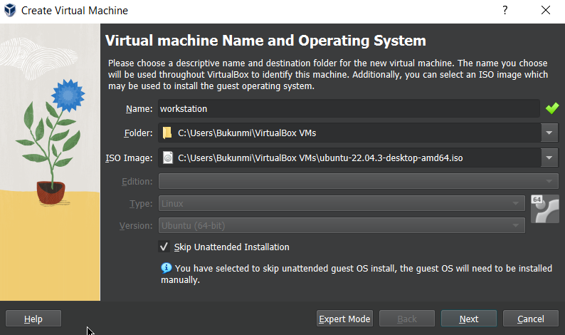
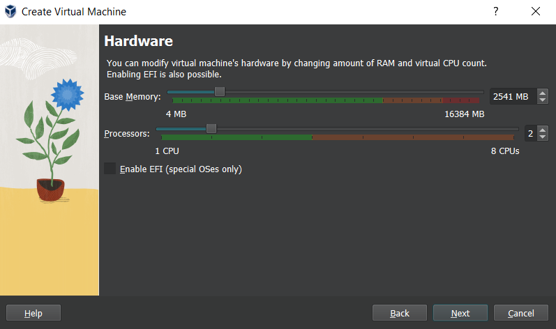
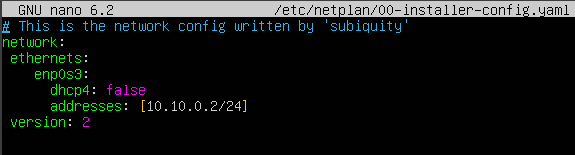
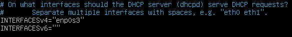
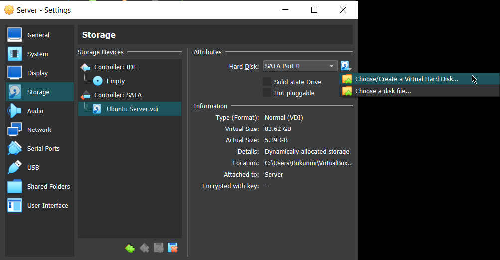
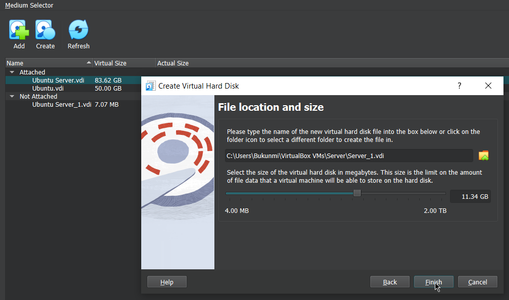

# Project: Establish Virtual Network for a Local Library

Project type: Solo <br>

## Project Context

The local library in your little town has no funding for Windows licenses so the director is considering Linux. Some users are sceptical and ask for a demo. The local IT company where you work is taking up the project and you are in charge of setting up a server and a workstation.

To demonstrate this setup, you will use virtual machines and an internal virtual network (your DHCP must not interfere with the LAN). You may propose any additional functionality you consider interesting.

## Must Have

Set up the following Linux infrastructure:

1. One server (no GUI) running the following services:

   - DHCP (one scope serving the local internal network) isc-dhcp-server
   - DNS (resolve internal resources, a redirector is used for external resources)-BIND
   - HTTP+ mariadb (internal website running GLPI)
   - **Required**
     1. Weekly backup the configuration files for each service into one single compressed archive
     2. The server is remotely manageable (SSH)
   - **Optional**
     1. Backups are placed on a partition located on separate disk, this partition must be mounted for the backup, then unmounted

2. One workstation running a desktop environment and the following apps:
   - LibreOffice
   - Gimp
   - Mullvad browser
   - **Required**
     1. This workstation uses automatic addressing
     2. The /home folder is located on a separate partition, same disk
   - **Optional**
     1. Propose and implement a solution to remotely help a user

## Goal

To establish an internal network of VM's and:

- Setup server and workstation
- Allow remote connection
- Implement suitable security measures

# VM Setup

Ubuntu virtual machines for the workstation and server were setup in a type-2 Virtualbox hypervisor. Each configured with the following parameters to suit their function.

**Configuration Table** <a name="table"></a>
|Parameter| Workstation | Server|
|---------|-------|------|
|RAM (MB)| 2541 | 3523|
|CPU |2|3|
|STORAGE (GB) |40 |83 |
|IMAGE TYPE |Ubuntu desktop |Ubuntu Server |
|IMAGE VERSION |22.04 LTS |22.04.4 LTS |

## Setting up Workstation VM

### 1. Install Ubuntu

Download the latest ubuntu desktop image (.iso) file [here](https://ubuntu.com/download/desktop). Open virtualbox, choose "NEW" icon to create new VM. Select the file location of the image file as shown below. Allocate considerable disk space, storage and CPU capacity. In my case 2541MB RAM, 2 CPU, and 40GB storage space.

<div style="display: flex;">
  
  
</div>

Once installation is complete, enter your login details at the prompt.

### 2. Install consumer software

In most debian-based linux distros, LibreOffice is pre-installed. Otherwise follow the installation steps.

To begin installations, first update package library and upgrade installed packages

```sh
sudo apt update
sudo apt upgrade

```

Install LibreOffice

```sh
sudo apt install libreoffice
```

Install GIMP

```sh
sudo apt install gimp
```

Install MullVad Browser

```sh
#download the browser compressed archive file
wget --content-disposition https://mullvad.net/en/download/browser/linux-x86_64/latest -P ~/Downloads

cd ~/Downloads

# extract files from the tar archive
tar -xvf mullvad-browser-linux-x86_64-X.X.tar.xz

cd ~/Downloads/mullvad-browser

#start mullvad browser
./start-mullvad-browser.desktop
```

For detailed information, consult [mullvad.net](https://mullvad.net/en/help/install-mullvad-browser)

### 3. Remote desktop setup

To enable remote desktop access, XRDP was installed. XRDP is a protocol implementation for enabling remote desktop access to linux systems from RDP clients. The RDP client used here is Remmina.

Install XRDP

```sh
sudo apt install xrdp

#Enable to ensure start at boot up
sudo  systemctl enable xrdp

#check status
sudo  systemctl status xrdp
```

Add user to the ssl-cert group

```sh
sudo usermod -aG ssl-cert <username>
```

Restart XRDP

```sh
sudo systemctl restart xrdp
```
Allow RDP port connection on firewall:
```sh
sudo apt install ufw
sudo ufw allow 3389
sudo ufw enable
```

Install Remmina on remote PC

```sh
sudo apt install remmina
```

You may now connect remotely to the workstation via the its ip address

# Setting up Server VM

The server is installed in a similar procedure to the workstation (_see above_). However, this time with the Ubuntu Server image file  and parameters as enumerated in the [installation table](#table). A console Ubuntu Server version is installed by default- no desktop environment.

## 1. Setup Server IP address

To ensure that the virtual network does not interfare with the LAN, assign a static IP address to the server, preferrably one with different IP address than the LAN.

Assign Server static IP:

```sh
sudo nano /etc/netplan/00-installer-config.yaml
```
Modify the .yaml file as shown:
_Replace ```10.10.0.2/24``` with your choice IP_


Apply changes:
```sh
sudo netplan apply
```

## 2. Setup DHCP Server

To automate IP address allocation, isc-dhcp-server was deployed.

First, install updates
```sh
sudo apt update
sudo apt upgrade
```

Install isc-dhcp-server
```sh
sudo apt install isc-dhcp-server
```

Modify the isc-dhcp-server default file:
```sh
sudo nano /etc/default/isc-dhcp-server
```


Modify the dhcpd config file:
```sh
sudo nano /etc/dhcp/dhcpd.conf
```
Copy and paste the following:
```sh
default-lease-time 600;
max-lease-time 7200;

ddns-update-style none;

authoritative;

option subnet-mask 255.255.255.0;
option broadcast-address 10.10.0.255;
option domain-name-servers {YOUR_SERVER_IP};
option domain-name {YOUR_DOMAIN_NAME};
option routers 10.10.0.1;

subnet 10.10.0.0 netmask 255.255.255.0 {
        range 10.10.0.10 10.10.0.40;
}


```
```sh
# Note: Do not include the server's ip address in the range 

# Alternatively, you may uncomment and modify the existing configurations appropriately instead of copy and paste.
```

Restart DHCP-Server and check status:
```sh
sudo systemctl restart isc-dhcp-server
sudo systemctl enable isc-dhcp-server
sudo systemctl status isc-dhcp-server
```

Verify configuration on workstation VM:
```sh
sudo dhclient -v
```

## 3. Setup DNS Server

For DNS resolver implementation, we used BIND. BIND queries other DNS servers to resolve DNS queries for clients. Find detailed configuration and setup [here](https://computingforgeeks.com/configure-master-bind-dns-server-on-debian/)

Install BIND:
```sh
sudo apt install -y bind9 bind9utils dnsutils
```
Open BIND configuration file:
```sh
sudo nano /etc/bind/named.config.options
```
Modify the configuration file as shown:
```sh
forwarders {
   8.8.8.8;
   8.8.4.4.; 
};

#allows to listen for DNS queries on all available network interfaces and IP addresses
listen-on {any;};
```
Reload BIND and enable at boot up:
```sh
sudo systemctl restart bind9
sudo systemctl enable bind9

#check status
sudo systemctl status bind9
```

Verify connectivity on workstation VM:
```sh
nslookup google.com
```

## 4. Setup GLPI
GLPI-enabled Internal website can be setup through manual installation of Apache2, Maria-DB, and GPLI extracted into the root of Apache2-```/var/www/html/```.

However, running a simple script developed by [github/jr0w3](https://github.com/jr0w3/GLPI_install_script) can automate this process.

Download the file in root and follow the prompt
```sh
su root

wget https://raw.githubusercontent.com/jr0w3/GLPI_install_script/main/glpi-install.sh && bash glpi-install.sh
```

Create a symbolic link to run the programs from any directory
```sh
sudo ln -s /etc/apache2/mods-available/rewrite.load /etc/apache2/mods-enabled/rewrite.load
```

Restart and enable Apache2
```sh
sudo systemctl restart apache2
sudo systemctl enable apache2
```

Ready to access GLPI interface. On the workstation VM, open a browser and search the server's IP address. 
```
Login: glpi
Password: glpi
```

Eureka!!! :)

## 5. Setup Firewall

Install uncomplicated firewall:
```sh
sudo apt install ufw
```
Enable start at boot:
```sh
sudo ufw enable
```
Allow network traffic for HTTP, HTTPS, DNS, SSH:
```sh
sudo ufw allow ssh        #port 22
sudo ufw allow 80/tcp     #HTTP
sudo ufw allow 443/tcp    #HTTPS
sudo ufw allow 53/tcp     #DNS
```

## 6. Setup SSH on Server
Enable Secure Shell access on server to allow remote login for Administrators

Install SSH
```sh
sudo apt update
sudo apt install openssh-server
```
Start and enable SSH
```sh
sudo systemctl start ssh
sudo systemctl enable ssh

#ensure SSH is running
sudo systemctl status ssh
```
Administrator can now connect to the server with the server login credentials.


## Weekly Backup of Configuration Files
To create a backup of configuration files on a partition located on a seperate disk, we follow two (2) main steps:
- Create new partition for the server VM
- Backup into the new partition

### 1. Create new partition
- Power off the server VM
- Go to the "Settings" of the virtual machine
- Navigate to the "Storage" tab
- Click on the "Controller: SATA"
- Click disk icon to add a new disk
- Choose "create a virtual hard disk"

- Allocate a new partition volume

- Select your new volume and click on "Choose"
- New volume create and attached sucessfully

Launch the Server VM and check available disks:
```sh
lsblk
```
Ideally, it should display the newly created partition ```/dev/sdb```

Format the partition to ext4:
```sh
sudo mkfs.ext4 /dev/sdb
```

## 2. Backup into the new partition
Now that the partition has been created and properly formatted

- Create a mount point (directory) for the new drive:
```sh
sudo mkdir /mnt/backup_conf
```
Write a script to mount the drive, backup configuration files, then unmount.

- Create new executable file ```backup_conf.sh```
```sh
su -
mkdir script
nano script/backup_conf.sh
```
- Add the following to the ```backup_conf.sh```:
```sh
#!/bin/bash

# This is a bash script to mount /dev/sdb drive,
# create backup of config files, then unmount.

mount /dev/sdb /mnt/backup_conf/
mkdir /tmp/$(date +%d-%b-%Y)
cp -r /etc/bind /etc/dhcp /etc/apache2 /etc/mysql /etc/php /etc/resolv.conf /tmp/$(date +%d-%b-%Y)/
tar -zcvf /mnt/backup_conf/$(date +%d-%b-%Y).tar.gz /tmp/$(date +%d-%b-%Y)/
rm -rf /tmp/$(date +%d-%b-%Y)
umount /dev/sdb
```
Deploy cronjob to schedule the script to launch every Friday at 5pm

- Open cron table for editing
```sh
crontab -e
```
- Paste to the cron table
```sh
00 17 * * 5 script/backup_conf.sh
```


!!! The setup is complete, and the configuration files backup is sucessful !!!
